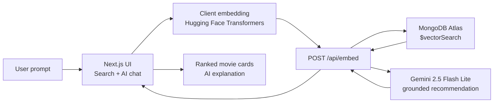
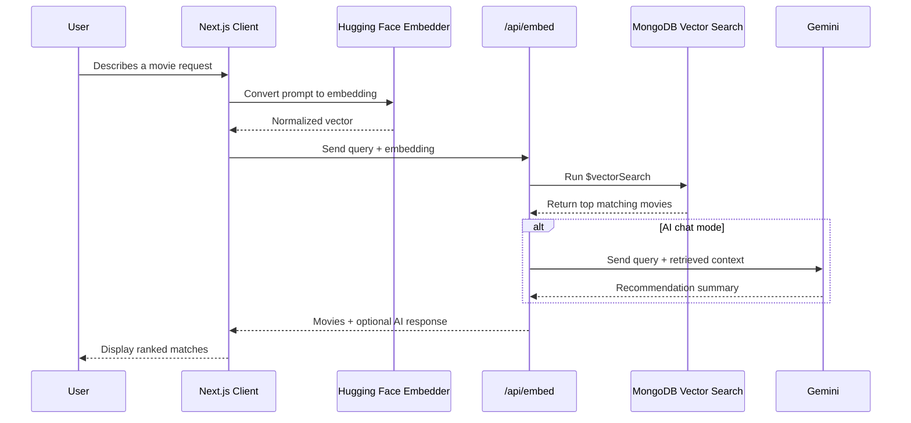
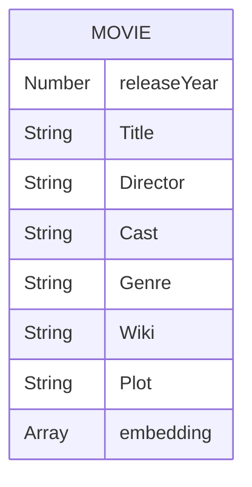

# MovieReco

An AI movie concierge that lets users describe the kind of film they want in natural language, then retrieves semantically similar movies from a vector-search catalogue and, in chat mode, asks Gemini to explain the best picks.

MovieReco is built as a full-stack Next.js app with client-side Hugging Face embeddings, MongoDB Atlas Vector Search, and Gemini-powered recommendation summaries.

## Why This Project

Most movie search tools rely on exact keywords, genres, or filters. MovieReco searches by intent: mood, plot, setting, actors, themes, pace, or the kind of night the user wants.

Example prompts:

- `slow-burn sci-fi about identity`
- `warm comedy for a family night`
- `crime thrillers with unreliable leads`
- `something eerie, smart, and not too violent`

## Core Features

- Natural language movie discovery
- Semantic search using `Xenova/all-MiniLM-L6-v2` embeddings
- MongoDB `$vectorSearch` over movie plot metadata
- Search mode for fast ranked results
- AI chat mode for conversational recommendations
- Gemini summaries grounded in retrieved movie records
- Responsive Next.js interface with movie cards and chat history

## Tech Stack

| Layer | Tools |
| --- | --- |
| Frontend | Next.js 15, React 19, Tailwind CSS |
| API | Next.js App Router API routes |
| Embeddings | Hugging Face Transformers, `Xenova/all-MiniLM-L6-v2` |
| Database | MongoDB, Mongoose, Atlas Vector Search |
| AI Recommendation | Google Gemini via `@google/genai` |

## Architecture



## Recommendation Flow



## Data Model



Each movie document stores searchable metadata plus an embedding generated from the title, release year, director, cast, genre, wiki page, and plot. MongoDB uses the `embedding` field for vector similarity search.

## Project Structure

```text
movie-reco/
+-- app/
|   +-- api/
|   |   +-- embed/route.js       # Vector search + Gemini response
|   |   +-- movie/route.js       # Movie import/embedding utility route
|   +-- components/
|   |   +-- MovieCard.js         # Result card UI
|   |   +-- SearchForm.js        # Search/chat input UI
|   +-- globals.css
|   +-- layout.js
|   +-- page.js                  # Main app experience
+-- lib/
|   +-- database.js              # MongoDB connection
|   +-- xenova.js                # Client-side embedding helper
+-- models/
|   +-- movie.model.js           # Mongoose movie schema
+-- moviejson/
|   +-- movie-plots.json         # Source movie dataset
+-- README.md
```

## Local Setup

Install dependencies:

```bash
npm install
```

Create `.env.local` in the project root:

```bash
MONGODB_URI=your_mongodb_connection_string
GEMINI_API=your_gemini_api_key
```

Run the development server:

```bash
npm run dev
```

Open:

```text
http://localhost:3000
```

## MongoDB Vector Index

The app expects a MongoDB Atlas vector index named `vector_index` on the `movies.embedding` field.

The search route runs:

```js
$vectorSearch: {
  index: 'vector_index',
  path: 'embedding',
  queryVector: embeddings,
  numCandidates: 100,
  limit: validLimit
}
```

## How It Works

1. The user enters a movie request in plain language.
2. The browser generates an embedding with Hugging Face Transformers.
3. The embedding is sent to `/api/embed`.
4. MongoDB Atlas Vector Search retrieves the closest movie records.
5. In chat mode, Gemini receives only those retrieved records as context.
6. The UI displays ranked movies and an explanation of why they match.

## What Makes It Share-Worthy

- Demonstrates practical retrieval-augmented generation for recommendations
- Combines semantic search with a grounded LLM answer
- Uses real movie metadata instead of hard-coded sample responses
- Keeps recommendations explainable by showing both the AI response and source records
- Ships as a polished full-stack Next.js experience

## Future Improvements

- Add poster images and richer movie metadata
- Save user sessions and recommendation history
- Add filters for year, genre, runtime, and language
- Stream Gemini responses for a smoother chat feel
- Add an admin import script for regenerating movie embeddings

## LinkedIn Pitch

I built MovieReco, an AI-powered movie concierge that turns natural language prompts into semantic movie recommendations.

Instead of searching by exact keywords, users can ask for things like "slow-burn sci-fi about identity" or "warm comedy for a family night." The app embeds the prompt with Hugging Face Transformers, retrieves similar movie records using MongoDB Atlas Vector Search, then uses Gemini to explain the strongest matches.

Stack: Next.js, React, MongoDB Atlas Vector Search, Hugging Face Transformers, Gemini, Mongoose.
